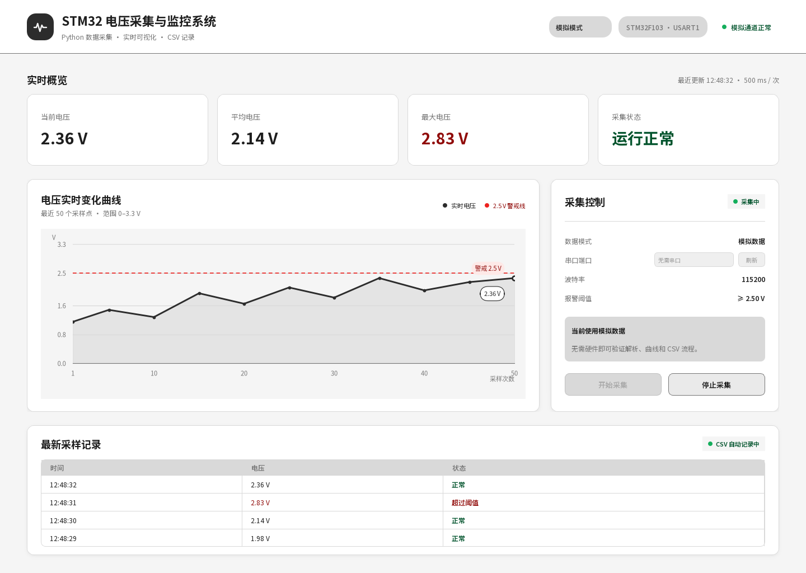

# STM32 串口数据采集与可视化系统

一个使用 Python、PySide6 和 Matplotlib 构建的桌面端电压监测工具。界面支持在**模拟模式**与**串口模式**之间切换：没有硬件时可以完整演示数据解析、实时曲线和 CSV 记录流程；接入 STM32 后则可直接读取真实串口数据。



## 功能

- 模拟/串口双数据源，一套界面和处理流程
- 自动发现可用串口，并支持刷新与波特率配置
- 实时电压曲线、最新值、平均值与采样数量展示
- 根据阈值标记正常、低电压和高电压状态
- 自动将采样结果保存为 CSV
- 无串口设备时给出明确提示，不会导致界面崩溃
- 数据源单元测试与离屏界面渲染脚本

## 快速开始

建议使用 Python 3.10 或更高版本。

```powershell
python -m venv .venv
.\.venv\Scripts\Activate.ps1
python -m pip install -r requirements.txt
python gui.py
```

程序默认使用模拟模式。切换到串口模式后，在顶部控制区选择端口和波特率，再点击“开始采集”。

## 串口数据格式

STM32 每行发送一个可转换为浮点数的电压值，并以换行符结束，例如：

```text
1.82
2.47
0.36
```

默认波特率为 `115200`。如固件配置不同，可在界面中选择其他波特率。

## CSV 输出

运行期间的数据写入 `voltage_data.csv`，格式如下：

```csv
time,voltage,status
2026-09-20 20:19:34,0.31,状态正常
```

真实运行数据已通过 `.gitignore` 排除；仓库中的 `voltage_data.example.csv` 可用于了解字段格式。

## 测试

```powershell
python -m unittest discover -s tests -v
```

## 项目结构

```text
gui.py                  主界面与交互控制
data_source.py          模拟/串口统一数据源
parse.py                串口文本解析
recorder.py             CSV 记录
plotter.py              图表相关逻辑
simulator.py            独立模拟数据脚本
realtime_plot.py        基础实时曲线示例
tests/                  数据源单元测试
assets/                 界面图标与字体资源
artifacts/              设计对照和运行截图
实现思路.md              页面实现总览
模拟与串口模式实现讲解.md  双模式设计的教学讲解
```

## 设计来源

界面依据 [Figma 设计稿](https://www.figma.com/design/5gUwaaByGkmrdu3w1v5d5i?node-id=3-9) 实现。设计对齐记录见 `design-qa.md`，代码思路与双模式架构说明分别见 `实现思路.md` 和 `模拟与串口模式实现讲解.md`。

